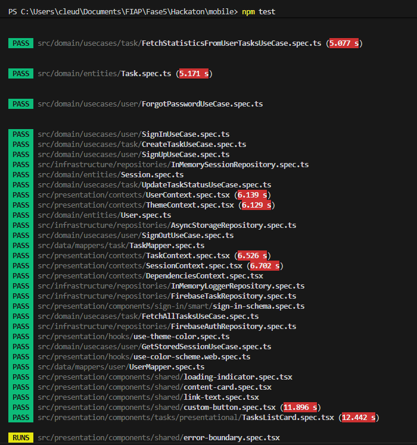
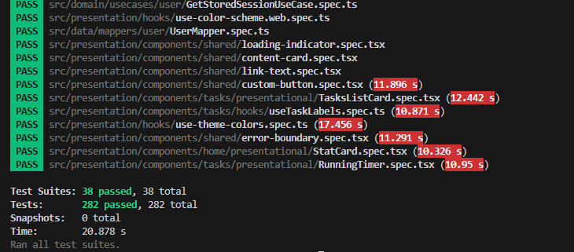

# FIAP - Hackaton - Mobile

Este repositório é referente ao desenvolvimento mobile do hackaton. Aqui você encontrará tudo que precisa pra executar o projeto, instalar novos módulos,etc. 


## Primeiros passos

### Pré Requisitos

Antes de iniciar o projeto, certifique-se de ter as seguintes tecnologias instaladas:

- **Node.js** (>= 18.x) – runtime JavaScript/TypeScript.
- **npm** (>= 9.x) ou **yarn** – gerenciador de pacotes.
- **Expo CLI** (>= 48.x) – para rodar e construir o app, instalado globalmente com `npm install -g expo-cli`.
- **Android Studio** e/ou **Xcode** (macOS) – emuladores/simuladores para testar em dispositivos.
- **Git** – controle de versão.

> 💡 Versões acima são as recomendadas durante o desenvolvimento. Pode funcionar com versões mais novas, mas verifique a compatibilidade do Expo.

### Tecnologias utilizadas

Este aplicativo móvel é construído com as seguintes principais tecnologias:

- **React Native** com **Expo** (router de arquivos).
- **TypeScript** para tipagem estática.
- **AsyncStorage** e **Firebase** para persistência e autenticação.
- **Jest** e **React Testing Library** para testes.
- Arquitetura limpa (Domain, Use Cases, Repositories, Infrastructure, Presentation).

### Passo a passo para instalação em nova máquina

1. Clone o repositório:

   ```bash
   git clone git@github.com:TC5Hackatton/mobile.git mobile
   cd mobile
   ```

2. Instale as dependências:

   ```bash
   npm install
   # ou yarn install
   ```

3. Duplique o arquivo `.env.example`, renomeie para `.env` e cole as credenciais do Firebase que foram enviadas junto com a entrega do projeto.
 
```.env
# Exemplo
EXPO_PUBLIC_FIREBASE_API_KEY=
EXPO_PUBLIC_FIREBASE_AUTH_DOMAIN=
EXPO_PUBLIC_FIREBASE_PROJECT_ID=
EXPO_PUBLIC_FIREBASE_STORAGE_BUCKET=
EXPO_PUBLIC_FIREBASE_MESSAGING_SENDER_ID=
EXPO_PUBLIC_FIREBASE_APP_ID=
EXPO_PUBLIC_FIREBASE_MEASUREMENT_ID=
```

4. Inicie o Metro bundler/expo:

   ```bash
   npm start # Ou você pode rodar diretamente com expo com o comando: npx expo start
   ```

5. Escolha a forma de execução na interface do Expo (emulador Android, simulador iOS, Expo Go etc.).

6. Comece a desenvolver editando os arquivos em **app/**.

### Estrutura do Projeto
 
 ```bash

├── app/
│   ├── _layout.tsx
│   ├── forgot-password.tsx
│   ├── index.tsx
│   ├── sign-in.tsx
│   ├── sign-up.tsx
│   ├── task-creation.tsx
│   └── (tabs)/
│       ├── _layout.tsx
│       ├── home.tsx
│       ├── preferences.tsx
│       └── tasks.tsx
└── src/
    ├── data/
    │   ├── index.ts
    │   ├── dtos/
    │   │   └── task/
    │   └── mappers/
    │       ├── task/
    │       └── user/
    ├── domain/                                                      ← Domínio
    │   ├── index.ts
    │   ├── entities/                                                ← Aqui estão as entidades do projeto mobile
    │   ├── enums/
    │   ├── repositories/
    │   └── usecases/                                                 ← UseCases - referente às regras de negócios
    │       ├── home/
    │       ├── task/
    │       └── user/
    ├── infrastructure/                                              ← Infraestrutura
    │   ├── error-handler.ts
    │   ├── index.ts
    │   └── repositories/
    └── presentation/                                                 ← Apresentação
        ├── assets/
        │   └── images/
        ├── components/
        │   ├── forgot-password/
        │   │   └── smart/
        │   ├── home/
        │   ├── preferences/
        │   ├── register-task/
        │   ├── shared/
        │   ├── sign-in/
        │   ├── sign-up/
        │   └── tasks/
        ├── constants/
        ├── contexts/
        └── hooks/
 ```

#### Onde Adicionar novos componentes
Seguindo as normas da Clean Architecture, cada tipo de serviço, componente ou utilitário tem seu lugar definido.
Use os exemplos abaixo para entender onde as novas peças do sistema devem viver.

- **Apresentação (presentation)**
  - Responsável por tudo que está ligado à UI e à interação do usuário.
  - Exemplo: um novo componente React para a tela de perfil, hooks de formulário (`useProfileForm`), ou contextos (`ProfileContext`).
  - Nesta camada também ficam estilos, temas e componentes reutilizáveis.

- **Domínio (domain)**
  - Abriga as regras de negócio independentes de framework e de plataforma.
  - Adicione aqui entidades (por exemplo, `User`, `Task`), interfaces de repositório, casos de uso (`CreateTaskUseCase.ts`) e enums.
  - Se você precisa modelar lógica ou validações que não dependem de Expo/React, coloque no domínio.

- **Infraestrutura (infrastructure)**
  - Implementações concretas para persistência, redes, armazenamento e serviços externos.
  - Exemplos: repositórios que usam Firebase (`FirebaseTaskRepository.ts`), adaptadores de AsyncStorage, ou um gerenciador de logs.
  - Esta camada sabe “como” fazer algo, enquanto o domínio apenas define “o que” precisa ser feito.

> 💡 Ao criar um novo recurso, pense primeiro em sua responsabilidade e escolha a camada adequada. Isso mantém o código modular, testável e fácil de manter.

#### Extra - Comandos Úteis
 ```bash
# Executar testes unitários
npm test

# Executar linting
npm run lint

# Rodar no emulador/dispositivo Android
npx expo run:android

# Rodar no simulador/dispositivo iOS (macOS apenas)
npx expo run:ios

# Abrir o app no Expo Go (exemplo)
npx expo start --tunnel
```
### Estilos e Temas

O projeto usa o **react-native-paper** como biblioteca de componentes e temas. As cores e fontes são definidas em `src/presentation/constants/paper-theme.ts` e existem dois objetos exportados (`lightTheme`/`darkTheme`) que são aplicados via `PaperProvider` no layout principal.

Para alternar entre modo claro/escuro há um contexto dedicado (`ThemeContext` em `src/presentation/contexts/ThemeContext.tsx`) que guarda o estado, persiste a escolha no `localStorage` e expõe os hooks **`useTheme`**, **`useThemeColor`** e **`useThemeColors`**. Estes hooks são usados por componentes como cartões de tarefa, preferências e abas para obter as cores certas com base no tema atual.

As fontes customizadas (Raleway) são carregadas no arquivo `app/_layout.tsx` usando `expo-font` e mantemos a splash screen até que os arquivos estejam prontos. A lógica de status bar e barra de navegação também leva em conta o tema escuro/claro.

O modo escuro foi aplicado não apenas como uma preferência estética, mas como uma ferramenta de acessibilidade cognitiva e conforto sensorial. A implementação justifica-se pelos seguintes pilares:

<ul>
  <li>Redução de Sobrecarga Sensorial: Para usuários com TEA (Autismo) ou Burnout, o excesso de luminosidade e o contraste agressivo de telas brancas podem causar fadiga visual e irritabilidade. O modo escuro minimiza a emissão de luz azul, proporcionando um ambiente digital mais acolhedor e menos estimulante.</li>
  <li>Controle de Ansiedade e Foco: Ambientes com cores mais sóbrias ajudam a reduzir a "poluição visual", permitindo que usuários com TDAH consigam manter a atenção no conteúdo central (como as tarefas e cronogramas) sem se distraírem com o brilho excessivo da interface.</li>
  <li>Leitura Facilitada: Em casos de fotofobia (comum em enxaquecas crônicas e alguns perfis neurodivergentes), o tema escuro reduz o ofuscamento, tornando a retenção de informações mais fluida e menos exaustiva.</li>
</ul>

#### Implementação Técnica de Acessibilidade
Para garantir que o MindEase seja verdadeiramente inclusivo, a alternância de temas segue diretrizes específicas:

<ol>
  <li>Contraste Otimizado: Diferente do "preto absoluto", utilizamos as variações de cinza profundo e azul marinho do nosso manual de identidade, o que evita o efeito de "halo" (borrão) que algumas pessoas com Dislexia sentem ao ler texto branco sobre fundo 100% preto.</li>
  <li>Consistência Sistêmica: Através do ThemeContext e do PaperProvider, garantimos que a transição de cores seja atômica em todo o app, evitando flashes de luz branca durante o carregamento de telas, o que poderia desencadear gatilhos sensoriais.</li>
  <li>Persistência de Preferência: A escolha do usuário é armazenada localmente para que o app respeite o "espaço seguro" configurado pelo estudante desde o primeiro frame da inicialização.</li>
</ol>

### Gerenciamento de estado/contextos

A camada de apresentação é orientada por contextos React para compartilhar estado entre telas:

- **`SessionContext`** – controle de autenticação (usuário atual, `isAuthenticated`, `signIn`, `signOut`, etc.). Protege rotas e é consultado no layout das tabs.
- **`TaskContext`** – mantém as tarefas carregadas, fornece métodos como `fetchTasks` e `createTask` e é usado pelas telas de lista e criação de tarefas.
- **`ThemeContext`** – já mencionado acima para modo claro/escuro.
- **`DependenciesContext`** – “injetor” simples que provê as implementações dos repositórios (Firebase, AsyncStorage, etc.) para os use‑cases.

Cada contexto exporta um provider e um hook (`useSession`, `useTask`, `useTheme`, `useDependencies`). Adicionar novo estado global envolve criar o contexto sob `src/presentation/contexts`, escrever o provider e utilizá‑lo no topo da árvore (normalmente em `app/_layout.tsx`).

### Navegação

A navegação é baseada em **expo-router** (file‑based routing). As rotas correspondem a arquivos dentro de `app/`:

- `app/index.tsx` → tela inicial pública
- `app/sign-in.tsx`, `sign-up.tsx`, `forgot-password.tsx` → fluxo de autenticação
- `app/task-creation.tsx` → formulário de nova tarefa
- `app/(tabs)/home.tsx`, `tasks.tsx`, `preferences.tsx` → abas privadas

O layout principal (`app/_layout.tsx`) configura um `Stack` do `expo-router` com as telas e encapsula o `PaperProvider`, `ThemeProvider`, etc. A sub‑pasta `(tabs)` possui seu próprio `_layout.tsx` que monta as abas e aplica proteção usando `useSession` (redireciona para `/sign-in` se não estiver autenticado). Para adicionar uma nova tela ou aba, basta criar o arquivo correspondente e, se necessário, ajustar as opções de navegação no layout.

Também há componentes reutilizáveis como `HapticTab`, `IconSymbol` e `LoadingIndicator` que são passados às opções de `Tabs.Screen` para personalização.

### Qualidade e Confiabilidade (Jest & Testing Library)

Para um aplicativo focado em saúde mental e neurodiversidade, a previsibilidade é uma regra de ouro. Falhas inesperadas ou comportamentos inconsistentes na interface podem gerar ansiedade e frustração no nosso público-alvo. Por isso, adotamos uma cultura de Test-Driven Development (TDD) rigorosa.

O conjunto de testes usa **Jest** + **React Testing Library** (configurado em `jest.setup.ts`) e cobre todas as camadas:

- **Domínio** – entidades (`User`, `Task`, `Session`) e use‑cases (`CreateTaskUseCase`, `SignInUseCase`, etc.) têm specs em `src/domain`.
- **Infraestrutura** – repositórios in‑memory, AsyncStorage e Firebase possuem testes que garantem contratos básicos.
- **Apresentação** – hooks (`use-theme-colors`, `useTaskLabels`), contextos (`ThemeContext`, `SessionContext`), componentes smart/presentational e schemas de validação são exercitados.

Para rodar os testes execute `npm test` ou `yarn test`. O comando já foi listado em “Extra – Comandos Úteis”, mas aqui reforçamos que novas specs devem ficar próximas ao código testado e utilizar o padrão `*.spec.ts` ou `*.spec.tsx`.

#### Por que escolhemos o Jest?
Escolhemos o Jest pela sua velocidade e isolamento de testes. Em um ambiente de desenvolvimento ágil como um hackathon, a capacidade de rodar testes em paralelo e o modo watch nos permitiram iterar rápido sem quebrar funcionalidades críticas de acessibilidade.

Não testamos apenas o "caminho feliz". Nossa suíte de testes abrange:

<ul>
  <li>Domínio e Lógica de Negócio: Garantimos que as regras de criação de tarefas e gerenciamento de sessões sejam impecáveis.</li>
  <li>Consistência de Interface (UI): Testamos nossos hooks customizados (use-theme-colors) e contextos para garantir que a transição entre modos claro e escuro nunca falhe, mantendo o conforto visual.</li>
  <li>Consistência de Interface (UI): Testamos nossos hooks customizados (use-theme-colors) e contextos para garantir que a transição entre modos claro e escuro nunca falhe, mantendo o conforto visual.</li>
</ul>

#### Resultado de testes com o Jest

Como evidenciado nos logs abaixo, alcançamos a marca de <b>282 testes aprovados</b> em <b>38 suítes de teste</b> diferentes.

<b>Destaque do Time:</b> Conseguimos validar componentes complexos de UI, como o `TasksListCard` e o `RunningTimer`, garantindo que cronômetros e etiquetas de tarefas funcionem com precisão milimétrica — algo vital para usuários com TDAH que dependem de indicadores visuais de tempo.


#### Evidências de Testes

##### Execução das Suítes de Teste
Abaixo, a execução detalhada mostrando a cobertura desde os casos de uso de domínio até os componentes de apresentação.

##### Resultado Final
Um ecossistema de software íntegro: 282 testes passando em apenas 20 segundos.




